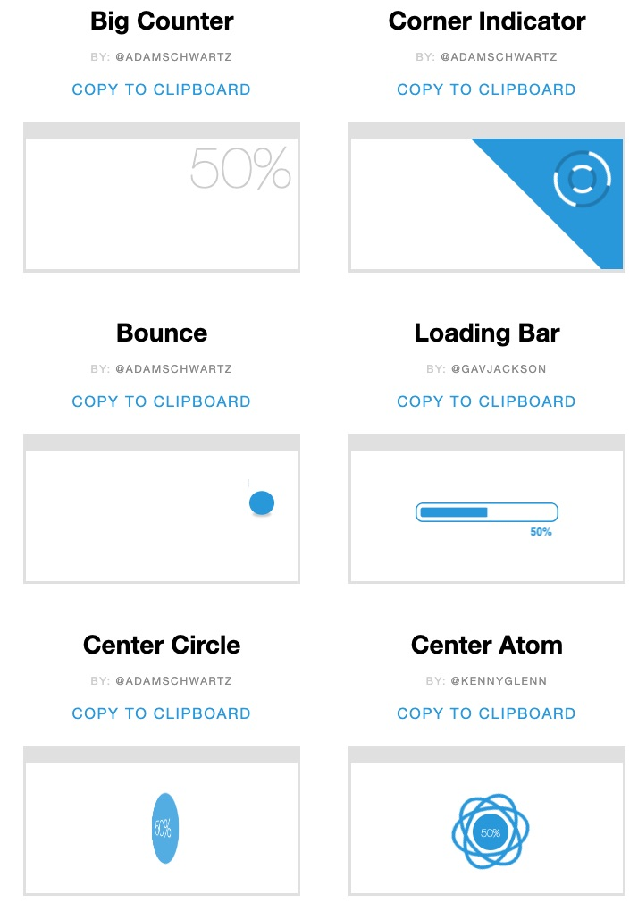

# pace

<!-- toc -->


- [About the Library](#about-the-library)
- [示意圖](#示意圖)
- [Installation](#installation)
- [Basic Usage](#basic-usage)  
- [線上資源](#%e7%b7%9a%e4%b8%8a%e8%b3%87%e6%ba%90)

<!-- tocstop -->

## About the Library

Pace 是一款可秀出頁面loading百分比的js，

- 不需要使用jquery
- 可根據page/ajax loading跑進度條、百分比數字
- 可套用多個[theme](https://github.hubspot.com/pace/docs/welcome/)，都是純css
- browser支援度(?)


## 示意圖


- 部份樣式示意



## Installation


```html
<head>
  <!-- 建議js在<head>就引入 -->
  <script src="https://cdnjs.cloudflare.com/ajax/libs/pace/1.0.2/pace.min.js"></script>

  <!-- css控制loading動畫樣式，選擇其中一個使用 -->
  <link href="css/pace-theme-bar.css" rel="stylesheet" />
  <!-- <link href="css/pace-theme-circle.css" rel="stylesheet" /> -->
  <!-- <link href="css/pace-theme-barbershop.css" rel="stylesheet" /> -->
</head>
```

## Basic Usage

html:
```html
<body>
  <iframe class="my-page" src="" ></iframe>
</body>
```

css:
```css
/* 做主頁淡入效果 */
.my-page{
	opacity: 0;
	transition: 0.5s;
}
.my-page.showmode{
	opacity: 1;
}
```

js:
```js
paceOptions = {
  ajax: false, // disabled
  document: false, // disabled
  eventLag: false, // disabled
  elements: {
    selectors: ['.my-page']
  }
};
Pace.on('done', function () {
  //pace loading 跑完時，.my-page addclass .showmode, 主頁做淡入效果。
  document.querySelectorAll('.my-page')
    .forEach(e => {
      e.classList.add('showmode');
    });
}); 
```


## 線上資源

- Lotte's Demo Site

  1.[demo](https://lottevic.github.io/pacedemo/src/index.html)

  2.[codepen](https://codepen.io/lotteyang/pen/eYNVdRJ)

- [Official Theme Website](https://github.hubspot.com/pace/docs/welcome/)

## 其他相關資源

- css preloader - 不用外掛的 css loading animation

  1. [影片:How to create a CSS Preloader Animation With Javascript Tutorial](https://youtu.be/NZNhuzyeD-Y)

  2. [codepen](https://codepen.io/petervandenheuvel/pen/ywBxxY)

html:
```html
<body>  
  <div class="preload">
    <!-- svg animation here -->
  </div>
  <section>
    <!-- main page here -->
  </section>
</body>  
```
css:
```css
.preload {
  position: fixed;
  width: 100%;
  height: 100vh;
  transition: opacity 1s ease 1s;
  ...
}
.preload-finish {
  opacity: 0;
  pointer-events: none;
}
```

js:
```js
window.addEventListener("load", () => {
  const preload = document.querySelector(".preload");
  preload.classList.add("preload-finish");
});
```
